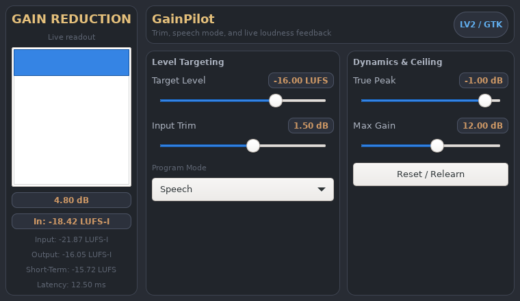

# GainPilot

GainPilot is an adaptive loudness auto-leveler built around BS.1770 / EBU-R128
workflows. A shared C++ DSP core is exported through the
[DISTRHO Plugin Framework](https://github.com/DISTRHO/DPF), giving every format
the same processing, parameters, state model, and cross-platform DGL editor.

## Status

This repository builds two plugin variants:

- `GainPilot`: stereo input and output with an automatable stereo/mono mode
- `GainPilotMono`: dedicated mono input and output

DPF exports both variants as:

- VST3 on Windows, Linux, and macOS
- Audio Unit on macOS
- CLAP on Windows, Linux, and macOS
- LV2 on Linux by default
- an optional standalone application for development

## Features

- Target-based loudness auto-leveling with automatic following or a locked input reference
- Explicit Learn Input / Stop & Lock capture and portable factory/user presets
- BS.1770 / EBU-R128 integrated, short-term, and momentary metering
- Linked stereo processing and a defined `0.5 * (L + R)` mono downmix
- True-peak ceiling and lookahead limiting
- Automatic and speech program modes
- Input trim, independent maximum boost/cut, and advanced correction controls
- Versioned cross-format parameter state
- One resizable DGL/NanoVG editor across all plugin formats and platforms
- Live applied-gain history and loudness readouts

<!-- gainpilot-ui-snapshot:start -->

## Plugin UI



<!-- gainpilot-ui-snapshot:end -->

## Build Requirements

Core requirements:

- CMake 3.25 or newer
- A C++20 compiler
- Git submodules initialized recursively

Linux UI builds also require OpenGL and X11 development packages. On Debian or
Ubuntu:

```sh
sudo apt-get install build-essential cmake pkg-config \
  libgl1-mesa-dev libx11-dev libxcursor-dev libxext-dev libxrandr-dev
```

`libebur128` is an optional independent test reference. All plugin builds use
the same bounded internal meter, including BS.1770 K-weighting and gated
integrated measurement; the library is never called on the audio thread. DPF and its nested Pugl dependency are pinned as Git
submodules. The Steinberg VST3 SDK, wxWidgets, GTK, and native LV2 SDK are no
longer direct project dependencies.

## Quick Start

Clone with submodules:

```sh
git clone --recurse-submodules <gainpilot-repository-url>
cd GainPilot
```

For an existing checkout:

```sh
git submodule update --init --recursive
```

Configure, build, and test:

```sh
cmake -S . -B build -DCMAKE_BUILD_TYPE=Release
cmake --build build --parallel
ctest --test-dir build --output-on-failure
```

Generated plugins are placed in `build/bin`. Install into a staging prefix and
create distributable archives with:

```sh
cmake --install build --prefix "$HOME/.local"
cpack --config build/CPackConfig.cmake
```

Typical install locations under the selected prefix are:

- Linux: `lib/vst3`, `lib/lv2`, and `lib/clap`
- macOS: `Library/Audio/Plug-Ins/VST3`, `Library/Audio/Plug-Ins/Components`, and `Library/Audio/Plug-Ins/CLAP`
- Windows: `VST3` and `CLAP`

## CMake Options

- `GAINPILOT_ENABLE_VST3` — build VST3 bundles; default `ON`
- `GAINPILOT_ENABLE_LV2` — build LV2 bundles; default `ON` on Linux
- `GAINPILOT_ENABLE_CLAP` — build CLAP plugins; default `ON`
- `GAINPILOT_ENABLE_AU` — build Audio Unit components; default `ON` on macOS
- `GAINPILOT_ENABLE_STANDALONE` — build DPF standalone applications; default `OFF`
- `GAINPILOT_ENABLE_TESTS` — build DSP, state, allocation, and host regression tests; default `ON`
- `GAINPILOT_ENABLE_PLUGINS` — build plugin/UI targets; set `OFF` for DSP-only validation
- `GAINPILOT_REFERENCE_TESTS` — compare against libebur128 when found; default `ON`
- `GAINPILOT_PLUGINVAL` — optional path to pluginval for strictness-10 VST3 host tests
- `GAINPILOT_CLAP_VALIDATOR` — optional path to the full external CLAP validator; see known transient-parameter failures in the validation notes. Dedicated CLAP host regressions run whenever CLAP and tests are enabled.
- `GAINPILOT_DPF_PATH` — use another DPF checkout instead of `dpf/`

## Learning and Presets

The **Follow** button keeps learning the input reference automatically. For a
repeatable source reference, press **Learn Input**, play the desired passage,
and press **Stop & Lock**. Capture requires a fresh measurement after reset;
silence and captures shorter than the 400 ms measurement window cannot lock.
**Lock** outside capture freezes the current reference. A locked reference is
saved with the session and survives resets and transport rewinds. It fixes the
source reference; dynamic correction and output feedback continue to operate.

Capture is an editor workflow, not saved session state. Closing the editor
cancels the capture workflow; automatic following continues. A transport rewind
starts fresh meter history. Changing channel interpretation can change the
measured loudness, so learn the reference in the intended mono/stereo mode.

The **Next Factory Preset** button applies the named preset and advances to the
next choice. **Save** and **Load** use portable `.gainpilot` files containing
versioned parameter state. Default, Speech -16 LUFS, and Gentle -18 LUFS provide
starting settings; their sound still needs evaluation on your material.

See [validation notes](docs/validation.md) for measured results, commands,
compatibility changes, and remaining listening checks.

## Project Layout

- `dpf/` — pinned DISTRHO Plugin Framework submodule
- `include/gainpilot/` — shared parameter, state, and DSP interfaces
- `src/dsp/` — format-independent loudness and limiter implementation
- `src/dpf/` — DPF plugin adapter, DGL editor, and mono/stereo metadata
- `tests/` — deterministic DSP and state smoke tests

## Compatibility Note

The GainPilot parameter IDs, symbols, and versioned state payload are retained.
DPF requires a different LV2 port topology and generates new VST3 components,
so the DPF builds intentionally use new LV2, VST3, and CLAP identities. Projects
saved with a pre-DPF build will not substitute the new plugin automatically;
render the old instance or copy its settings before replacing it. The new DPF
formats share the same GainPilot state payload with each other.

## Contributing

See [CONTRIBUTING.md](CONTRIBUTING.md).

## License

GainPilot is MIT licensed. See [LICENSE](LICENSE). DPF is distributed under its
own ISC license in the `dpf/` submodule.

## Changelog

Versioned changes are tracked in [CHANGELOG.md](CHANGELOG.md).
